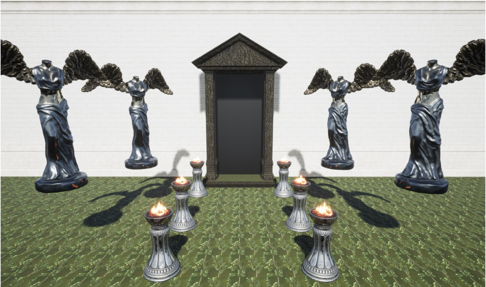

<!-- Improved compatibility of back to top link: See: https://github.com/othneildrew/Best-README-Template/pull/73 -->

<!--
*** Thanks for checking out the Best-README-Template. If you have a suggestion
*** that would make this better, please fork the repo and create a pull request
*** or simply open an issue with the tag "enhancement".
*** Don't forget to give the project a star!
*** Thanks again! Now go create something AMAZING! :D
-->

<!-- PROJECT SHIELDS -->
<!--
*** I'm using markdown "reference style" links for readability.
*** Reference links are enclosed in brackets [ ] instead of parentheses ( ).
*** See the bottom of this document for the declaration of the reference variables
*** for contributors-url, forks-url, etc. This is an optional, concise syntax you may use.
*** https://www.markdownguide.org/basic-syntax/#reference-style-links
-->

    

<!-- PROJECT LOGO -->
 

  <h3 align="center">Nothing Gold Can Stay</h3>
  

    Players take on the role of an explorer trapped in an endlessly looping cursed temple, searching for treasure while uncovering the fate of those who came before. As they progress, the player will be faced with choices that will determine their ultimate fate - greed, insanity, or perseverance.
     
    

    <a href="https://www.youtube.com/embed/Tpz537jXkXo" target="_blank">Trailer</a>
    

  

<!-- TABLE OF CONTENTS -->

  
Table of Contents

  <ol>
    <li>
      <a href="#about-the-project">About The Project</a>
      <ul>
        <li><a href="#built-with">Built With</a></li>
      </ul>
    </li>
    <li>
      <a href="#getting-started">Getting Started</a>
      <ul>
        <li><a href="#prerequisites">Prerequisites</a></li>
        <li><a href="#installation">Installation</a></li>
      </ul>
    </li>
    <li><a href="#contact">Contact</a></li>
    <li><a href="#acknowledgments">Acknowledgments</a></li>
  </ol>

<!-- ABOUT THE PROJECT -->
## About The Project

The game starts with the player character trapped in a large room with a large altar in the middle. The player will progress through the level, encountering evidence of the explorers who came before them and discovering the mechanics of the game. The level is designed to loop seamlessly, with the player always coming back to the beginning of the room whenever they reach the end. The objects and props in the game, such as the doorway, ax, and gold, serve to advance the plot and challenge the player's preconceptions.

The anticipated player flow through the environment is that players will navigate through the first loop relatively quickly. When they go through the first loop and re-enter the level from the beginning, they will feel confused as to what happened and whether they did something wrong during their "first playthrough." At that point, they will pay more attention to the level and identify new objects within the environment. Lastly, the game challenges the player's preconceptions by giving them a weapon during later loops, leading to the "bad" ending.

Project Goal: The goal of Nothing Gold Can Stay is to create an immersive horror experience that challenges the player's preconceptions and keeps them engaged throughout the game. The team aimed to create a looping level that seamlessly integrates the game's mechanics and story, allowing the player to discover the backstory and the fate of the explorers who came before them.

### Built With

Major frameworks/libraries used to bootstrap the project.

* Unreal 4.27

### Prerequisites

* Windows 10+
* Unreal 4.27

### Installation

1. Clone the repo

2. Open Project in Unreal

3. Play the Project inside Unreal or Make a Build

<!-- CONTACT -->
## Contact

* Kalpan Agrawal - agrawal.k@northeastern.edu
* [![LinkedIn][linkedin-shield]][linkedin-url]
* [![Portfolio][portfolioIcon-url]][portfolio-url]

<!-- MARKDOWN LINKS & IMAGES -->
<!-- https://www.markdownguide.org/basic-syntax/#reference-style-links -->
[linkedin-shield]: https://img.shields.io/badge/-LinkedIn-black.svg?style=for-the-badge&logo=linkedin&colorB=555
[linkedin-url]: https://www.linkedin.com/in/kp-ag/
[portfolioIcon-url]: https://img.shields.io/badge/-Portfolio-brightgreen
[portfolio-url]: https://kalpan-ag.github.io/

